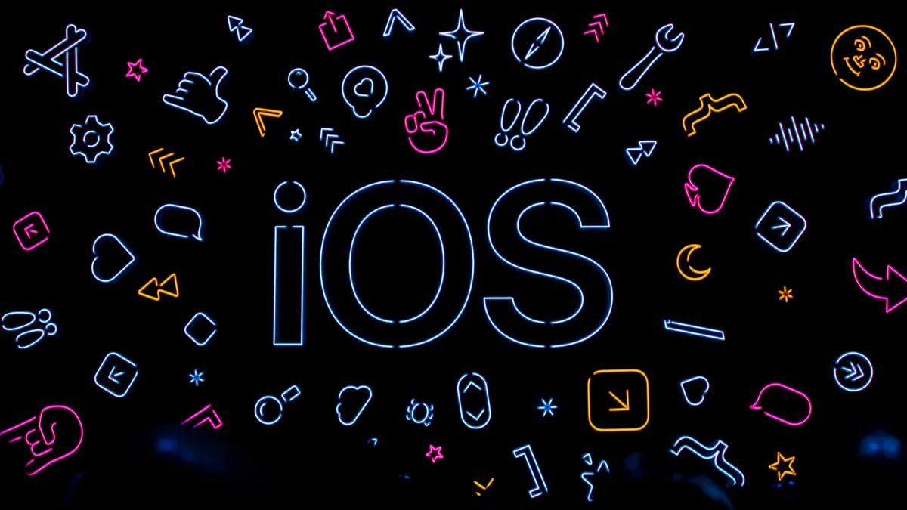

# 🚀 iOS Engineer Roadmap

A list of knowledge that every iOS engineer should know

### If this project helped you or you enjoyed it, please give it a star ⭐ It will show me that I have helped someone at least 😅

# 😎 Who is it for?
The iOSRoadmap repository is a great resource for iOS developers who want to learn about the latest technologies and best practices. It covers a wide range of topics, from beginner to advanced.

# 🧐 I want to check the boxes
1. Fork the repo
2. Change checkbox from '[ ]' to '[x]' next to the finished topic
    - [ ] before
    - [x] after
3. Commit and push

# 👨🏻‍🔬 Computer science
[Materials](Pages/Computer_science/cs.md)
# 🦾 Algorithms
[Materials](Pages/Algorithms/algorithms.md)
# 🔥 Git
[Materials](Pages/Git/git.md)
# 🏎 iOS and Swift
[Materials](Pages/iOSAndSwift/Swift.md)
# 💿 Memory
[Materials](Pages/Memory/memory.md)
# 👨🏼‍🔧 Multithreading
[Materials](Pages/Multithreading/multithreading.md)
# 👀 UI
[Materials](Pages/UI/ui.md)
# 🫠 Rendering
[Materials](Pages/Rendering/rendering.md)
# 🥵 Animations
[Materials](Pages/Animations/animations.md)
# 💾 Repositories and databases
[Materials](Pages/Databases/db.md)
# 🔐 Security and encryption
[Materials](Pages/Security/security.md)
# ✅ Tests
[Materials](Pages/Tests/tests.md)
# 🤖 Utils
[Materials](Pages/Utils/utils.md)
# 🍀 Architecture and Design patterns
[Materials](Pages/Architecture_and_Design_patterns/designPatterns.md)
# 🚀 CI
[Materials](Pages/CI/ci.md)
# 🔮 Extra
[Materials](Pages/Extras/extra.md)
# 🧸 SoftSkills
[Materials](Pages/SoftSkills/softskills.md)
